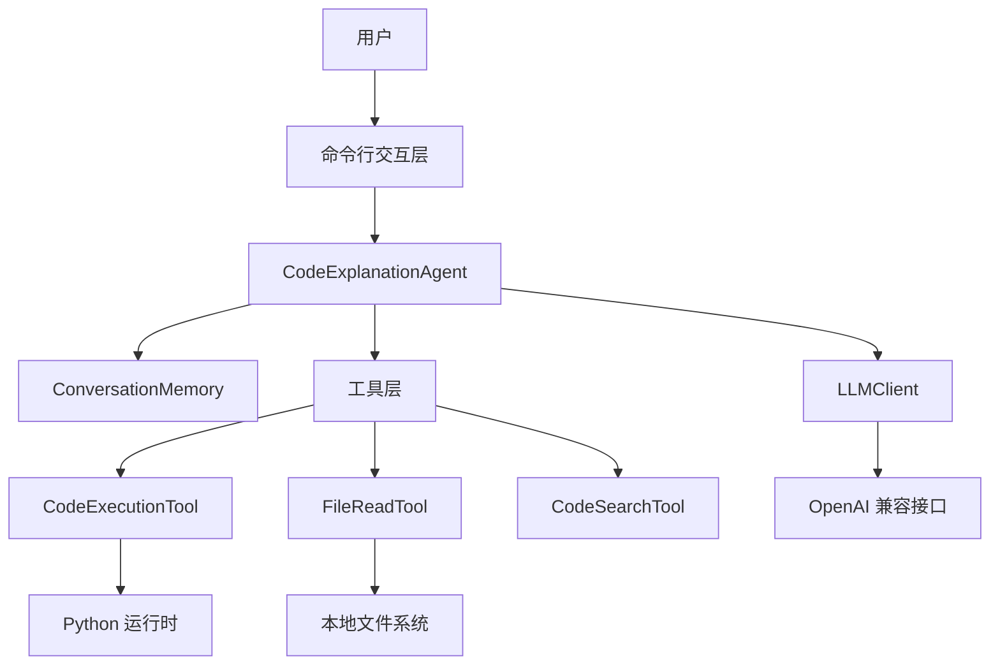
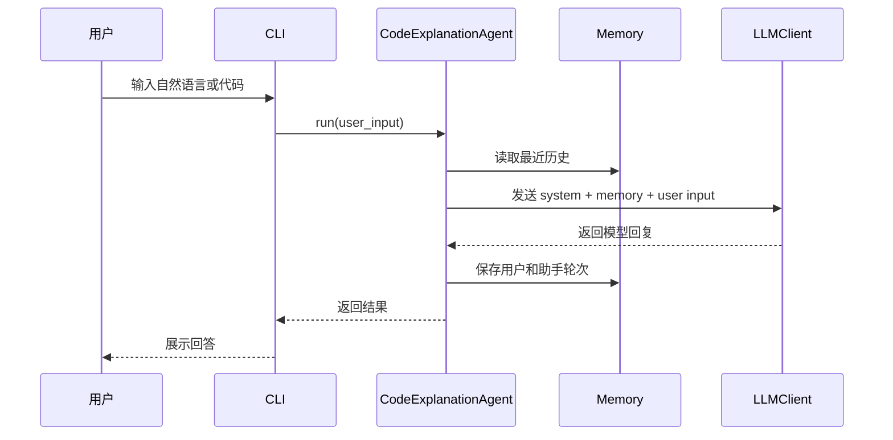
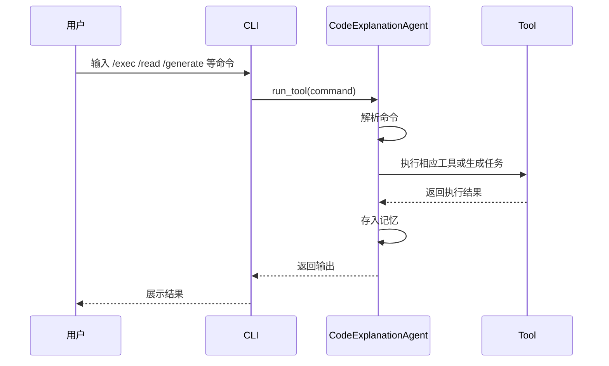

# 设计文档

## 1. 项目概述

本项目是一个基于 Python 实现的轻量级本地 AI 编程助手，目标是帮助开发者在终端环境中完成以下任务：

- 解释代码逻辑
- 根据需求生成代码
- 修复代码中的 Bug
- 审查代码质量
- 生成单元测试
- 提供重构建议
- 验证代码执行结果
- 读取本地文件并理解上下文

它并不是一个单纯的聊天机器人，而是一个带工具能力的 Agent。它结合了大语言模型、上下文记忆、命令行交互和代码执行能力，适合学习和扩展。

该系统遵循经典的 Agent + Tool + Memory + LLM 设计模式。

---

## 2. 设计目标

### 2.1 主要目标

- 以自然语言解释代码功能和逻辑
- 根据需求直接生成可运行代码
- 分析错误并给出修复方案
- 对代码进行审查并给出优化建议
- 为函数或脚本自动生成测试用例
- 提供代码重构思路和示例
- 通过执行代码验证结论是否成立
- 支持多轮对话上下文保持

### 2.2 非目标

- 不追求完全替代 IDE
- 不提供跨会话长期记忆持久化
- 不支持多人协作环境
- 不构建复杂插件生态
- 不提供完全安全的任意代码执行沙箱

---

## 3. 总体架构

整个系统可以分成四层：

1. 用户交互层
2. Agent 控制层
3. 工具层
4. 模型访问层

### 3.1 总体结构图



---

## 4. 模块设计

## 4.1 用户交互层

命令行入口位于主函数中，负责：

- 展示欢迎信息
- 解析用户输入
- 处理内置命令
- 调度 Agent 处理自然语言请求
- 调度工具执行命令

主要职责包括：

- 读取标准输入
- 判断是否是内置命令
- 将命令分发到不同工作流
- 输出结果给用户

入口函数是 main()，整个交互循环也由它驱动。

---

## 4.2 Agent 控制层

核心类是 CodeExplanationAgent。

它负责：

- 组装提示词
- 读取历史上下文
- 调用 LLM
- 处理普通对话任务
- 处理 /generate、/fix、/review、/testgen、/refactor 等命令
- 保存本轮用户和助手的历史记录

### 4.2.1 关键方法

- run(user_input: str)
  - 处理普通对话轮次
- run_tool(tool_command: str)
  - 处理命令式工具调用
- _build_messages(user_input: str)
  - 构建 system + memory + current input 的消息列表
- _process(messages)
  - 调用模型并返回结果
- status()
  - 显示当前 agent 状态

### 4.2.2 提示词设计

系统提示词把助手定义为专业的 AI 编程助手，明确要求它具备：

- 解释代码逻辑
- 生成代码
- 修复 Bug
- 审查代码质量
- 生成测试
- 提供重构建议

这使它更像程序员协作助手，而不是普通聊天机器人。

---

## 4.3 记忆层

ConversationMemory 类负责管理多轮对话上下文。

### 职责

- 保存历史消息
- 保持最近上下文
- 超出上限时丢弃更早记录

### 记录结构

每条消息包含：

- role
- content
- timestamp

### 策略

系统使用固定窗口的上下文保留策略。通过 max_turns 参数控制最多保留多少轮，超出后会丢弃最早的对话。

这种策略的优点是：

- 保留最近对话脉络
- 避免 token 消耗过大
- 不会因为历史过长导致上下文失真

---

## 4.4 工具层

项目定义了基类 Tool，并提供多个具体工具类。

### 4.4.1 工具抽象

```python
class Tool:
    def __init__(self, name, description):
        ...

    def execute(self, argument: str) -> str:
        raise NotImplementedError
```

这种设计让 Agent 可以动态扩展工具，而不必重写整个控制逻辑。

### 4.4.2 CodeExecutionTool

用途：

- 执行用户提供的 Python 代码
- 通过真实运行结果验证代码行为

实现细节：

- 通过 subprocess.run 调用当前 Python 解释器
- 捕获 stdout 和 stderr
- 设置 30 秒超时，防止死循环阻塞
- 返回带有 [STDOUT] 和 [STDERR] 的执行输出

意义：

- Agent 可以通过运行代码验证解释是否正确
- 让静态分析变成可执行验证

### 4.4.3 FileReadTool

用途：

- 读取项目中的代码文件
- 让 Agent 能查看本地代码上下文

实现细节：

- 将相对路径转换为绝对路径
- 检查访问位置是否在项目根目录下
- 使用 UTF-8 读取文件内容
- 拒绝访问项目外的文件

这是一个基础的安全措施，用于避免明显的路径穿越问题。

### 4.4.4 CodeSearchTool

用途：

- 为 API / 文档 / 使用方式搜索提供入口
- 后续可扩展为真实搜索引擎或知识库

当前实现是模拟返回，属于占位型工具，后续可以接真实搜索能力。

---

## 4.5 模型层

LLMClient 类负责和大模型服务交互。

### 职责

- 初始化模型客户端
- 选择后端实现
- 发送消息请求
- 处理重试逻辑
- 解释常见 API 错误

### 后端支持

代码目前支持两种模式：

1. LangChain 的 ChatOpenAI
2. 原生 OpenAI SDK

这样可以兼容 OpenAI 风格的接口，降低对单一 SDK 的依赖。

### 配置参数

- api_key
- model
- base_url

通过这种设计，可以接入不同厂商的 OpenAI 兼容 API。

---

## 5. 请求流程

## 5.1 普通对话流程



## 5.2 工具命令流程



---

## 6. 支持的命令

项目既支持内置命令，也支持编程助手类命令。

### 6.1 内置命令

- help
- status
- clear
- exit
- quit

### 6.2 工具型命令

- /exec <代码>
- /read <路径>
- /search <关键词>
- /generate <需求>
- /fix <问题或代码>
- /review <代码>
- /testgen <代码或需求>
- /refactor <代码或需求>

### 6.3 普通输入

其他输入会被当作自然语言问题，例如：

- 解释函数功能
- 总结一段代码
- 提出实现方案
- 找出 bug 原因
- 生成测试用例
- 分析代码重构方案

---

## 7. 环境变量与配置设计

该项目面向 OpenAI 兼容接口，因此可接入多种模型平台。

### 支持的环境变量

- OPENAI_API_KEY
- OPENAI_API_BASE
- DASHSCOPE_API_KEY
- DASHSCOPE_API_BASE
- AGENT_MODEL

### 配置优先级

主程序读取参数时采用以下顺序：

```python
api_key = os.getenv("DASHSCOPE_API_KEY", os.getenv("OPENAI_API_KEY", ""))
model = os.getenv("AGENT_MODEL", "qwen-plus")
base_url = os.getenv("DASHSCOPE_API_BASE", os.getenv("OPENAI_API_BASE", None))
```

这意味着在两套配置同时存在时，默认优先使用 DashScope 的配置，但 OpenAI 兼容配置仍然有效。

### 为什么这很重要

常见问题来自于供应商不匹配，例如：

- DeepSeek 的 key 与 DashScope 的 base URL 混用
- DashScope 的 key 与 DeepSeek 的模型地址混用
- 模型名不匹配当前 API 服务

因此设计要求开发者保持 key、base_url 和 model 的一致性。

---

## 8. 安全性考虑

当前实现包含一些基础安全机制，但还不是严格的生产级沙箱。

### 8.1 文件访问限制

FileReadTool 会确保读取路径位于工作目录下，防止明显的目录穿越访问。

### 8.2 代码执行超时

CodeExecutionTool 设置了执行超时，避免死循环导致程序卡死。

### 8.3 安全限制

当前仍然属于本地开发工具，而不是安全隔离的远程执行环境。它没有提供：

- 容器化执行
- 文件系统隔离
- 网络访问限制
- 对不可信代码的完整沙箱保护

如果用于生产环境，建议增加更强的执行隔离方案。

---

## 9. 可扩展性设计

本项目结构简单，扩展成本较低。

### 9.1 添加新工具

只要继承 Tool 基类，并在 CodeExplanationAgent 的 self.tools 中注册即可。

例如可以增加：

- git diff 工具
- 代码格式化工具
- 仓库测试工具
- 项目分析工具
- 架构总结工具

### 9.2 添加新命令

CLI 循环中可以新增新的命令分支，例如：

- /analyze
- /fixfile
- /testall
- /lint
- /gitstatus

### 9.3 替换搜索能力

当前 CodeSearchTool 是占位实现，后续可以升级为：

- Bing / Google 搜索 API
- 本地文档索引
- 专用知识库查询
- 内部文档搜索服务

### 9.4 改进模型管理

后续设计可进一步支持：

- 多 provider 选择
- 模型路由
- 兜底 provider
- 带退避的重试机制
- 上下文压缩

---

## 10. 设计优点

- 架构简单，容易学习和维护
- 适合本地开发环境运行
- 依赖较少，部署成本低
- 将 LLM 推理与真实工具结合
- 支持多轮上下文记忆
- 能够扩展成为更强的编程助手

---

## 11. 设计缺点和风险

- 代码执行没有强隔离能力
- 仅能手动读取文件，缺少项目级分析能力
- 历史记录仅存在内存中，重启会丢失
- 搜索能力较弱
- 对大规模代码库的理解仍然有限
- 模型输出质量高度依赖提示词和提供商能力

---

## 12. 下一步建议

为了将该项目发展成更成熟的 AI 编程助手，推荐继续做以下增强：

1. 增加项目级代码索引
2. 支持多文件语义搜索
3. 增加自动补丁写回能力
4. 集成测试执行器
5. 集成静态分析和 linter
6. 增加项目级记忆持久化
7. 建立更安全的代码执行沙箱
8. 对生成结果增加结构化输出格式
9. 增加命令历史和会话保存
10. 引入更强的工具注册与插件机制

---

## 13. 总结

本项目是一个紧凑且可扩展的 AI 编程助手，核心设计非常清晰：

- Agent 负责推理和调度
- Tool 提供代码执行、文件读取和搜索能力
- Memory 负责上下文保存
- LLMClient 提供模型访问和错误处理

它很好地体现了现代 AI 编程助手的核心思想：让大语言模型不仅能回答问题，还能结合实际工具支持开发者进行代码理解、生成、修复、测试和重构。

当前版本更像是一个轻量级基础框架，适合教学、原型开发和进一步扩展。